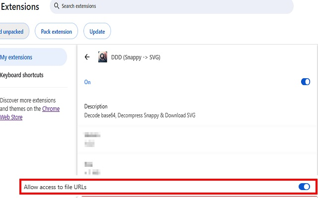
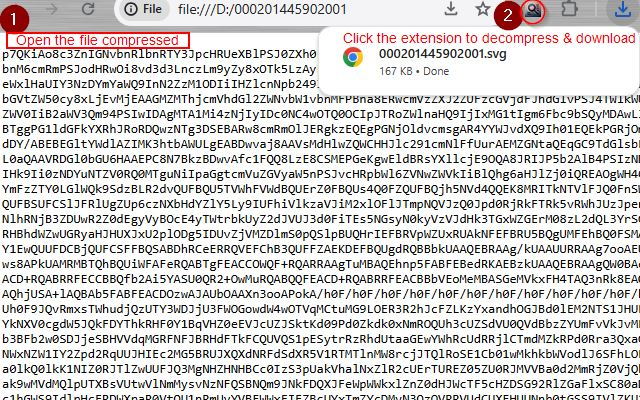

	

> Available on Chrome Web Store: [Click HERE](https://chromewebstore.google.com/detail/ddd-snappy-%3E-svg/cfkblmhphbebldiikdhfddebglfbbigj?hl=en)

Decode base64, Decompress Snappy/Zlib & Download SVG

1) Allow access to file URLS:

2) Open a file compressed with Chrome. The file must be compressed with Snappy/Zlib and encoded with Base64.
3) Click the extension icon to download the original file uncompressed.

	

> Future features:
- ~~Support zlib compression type~~ (1.1.0 implemented)
- Customizable extension (not only SVG) for downloaded files
